# 📦 Inventory Warehouse Intelligence Platform


Enterprise Inventory & Warehouse Intelligence Platform enabling inventory visibility, warehouse operations, supplier intelligence, procurement workflows, and operational analytics.

<p align="center">
  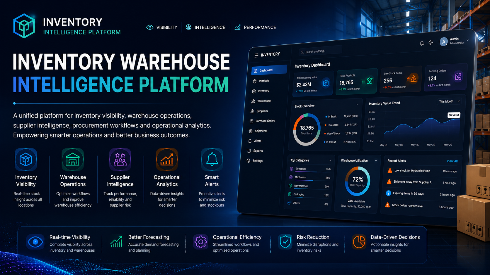
</p>

---

## 🌐 Live Platform

Experience the platform in action:

**Live Demo:** https://inventory.shivamitconsultancy.com/

---

## 🌐 Platform Vision

Inventory Warehouse Intelligence Platform is a modern enterprise operations platform engineered to help organizations centralize inventory management, warehouse operations, supplier relationships, stock monitoring, and operational analytics within a unified digital ecosystem.

The platform delivers real-time inventory visibility, warehouse performance insights, supplier intelligence, and operational decision support through an intuitive enterprise-grade experience.

Designed with a product-engineering mindset, the platform focuses on operational efficiency, inventory optimization, warehouse visibility, supplier collaboration, and scalable business operations.

---

## ✨ Platform Highlights

* Inventory Intelligence Dashboard
* Warehouse Operations Monitoring
* Supplier Intelligence Platform
* Inventory Flow Analytics
* Stock Health Monitoring
* Warehouse Capacity Management
* Procurement Visibility
* Operational Alerts & Notifications
* AI-Powered Operational Insights
* Enterprise Reporting Infrastructure

---

## 📊 Inventory Intelligence Infrastructure

### Inventory Operations

The platform provides centralized inventory management capabilities designed to improve inventory visibility and operational efficiency.

Capabilities include:

* Product inventory management
* Stock level monitoring
* Inventory categorization
* Inventory movement tracking
* Inventory health analysis
* Reorder intelligence
* Inventory performance monitoring

---

### Warehouse Operations

Warehouse teams can monitor and optimize operational workflows through centralized warehouse visibility.

Capabilities include:

* Warehouse capacity tracking
* Inventory flow monitoring
* Shipment visibility
* Warehouse activity tracking
* Multi-location inventory oversight
* Stock transfer workflows
* Operational performance monitoring

---

### Supplier Intelligence

The supplier management ecosystem enables organizations to evaluate supplier performance and improve procurement operations.

Capabilities include:

* Supplier scorecards
* Supplier reliability monitoring
* Fulfillment performance tracking
* Delivery analytics
* Risk assessment monitoring
* Contract visibility
* Supplier activity tracking

---

## 🚨 Operational Monitoring

The platform includes an operational alerting infrastructure designed to improve inventory responsiveness and operational awareness.

Features include:

* Low stock alerts
* Reorder recommendations
* Expiry monitoring
* Supplier delay notifications
* Alert history tracking
* Inventory threshold monitoring
* Operational event visibility

---

## 🤖 Operational Intelligence

The platform incorporates intelligent operational insights to support decision-making and inventory optimization.

Capabilities include:

* Inventory recommendations
* Stock optimization insights
* Demand forecasting visibility
* Inventory health monitoring
* Operational trend analysis
* Performance intelligence dashboards

---

## 🏢 Enterprise Features

* Inventory Visibility Platform
* Warehouse Operations Management
* Supplier Intelligence Infrastructure
* Procurement Workflow Visibility
* Inventory Analytics Dashboard
* Operational Monitoring System
* Business Intelligence Reporting
* Responsive Enterprise Interface
* Role-Based Access Architecture
* Scalable Operational Infrastructure

---

## 💻 Technology Stack

### Frontend Engineering

- Angular 17
- TypeScript 5.2
- RxJS
- Angular Router

### UI & Experience

- Tailwind CSS 3.4
- GSAP 3.12.5
- Lottie Web
- Angular Animations
- CSS Animations
- Google Fonts

### Development

- Angular CLI
- Node.js
- npm / Yarn

---

## 🏗️ System Architecture

The platform follows a modular inventory and warehouse operations architecture designed to support inventory visibility, warehouse management, supplier intelligence, operational monitoring, and business analytics within a scalable enterprise environment.

The architecture centralizes inventory operations, warehouse workflows, supplier collaboration, and operational insights into a unified business platform engineered for operational efficiency and decision-making.

<p align="center">
  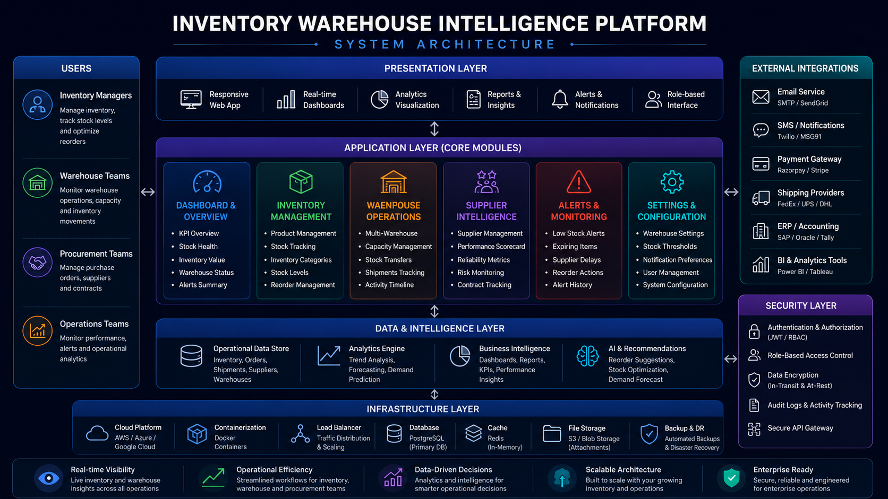
</p>

---

## 📸 Platform Preview

Modern inventory and warehouse operations engineered for inventory teams, warehouse managers, procurement teams, and operational decision-makers.

The platform delivers real-time inventory visibility, warehouse intelligence, supplier performance analytics, operational monitoring, and intelligent business workflows through a centralized enterprise experience.

---

# 🌐 Platform Screenshots

### 📊 Inventory Intelligence Dashboard

<p align="center">
  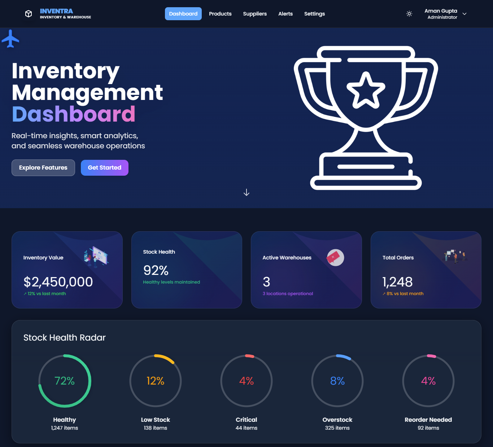
</p>

---

### 📈 Inventory Analytics & Operational Intelligence

<p align="center">
  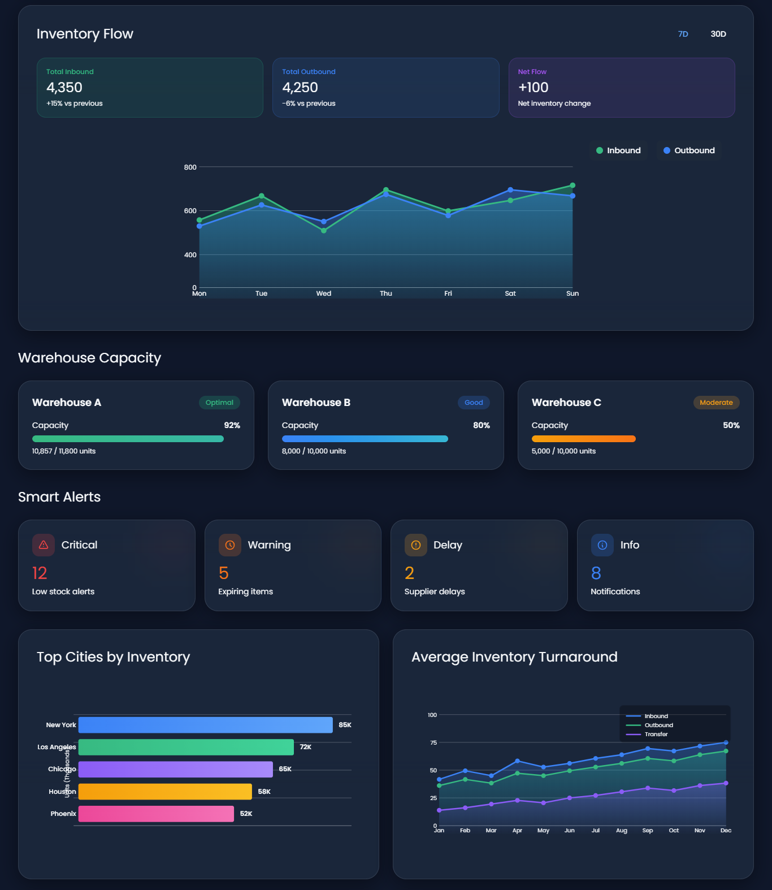
</p>

---

### 🚚 Warehouse Operations & Activity Monitoring

<p align="center">
  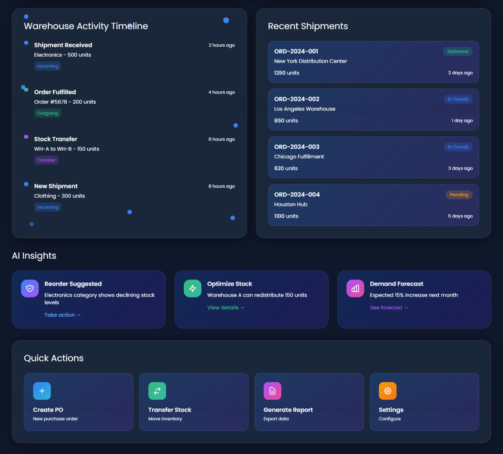
</p>

---

### 🤖 Operational Intelligence & Recommendations

<p align="center">
  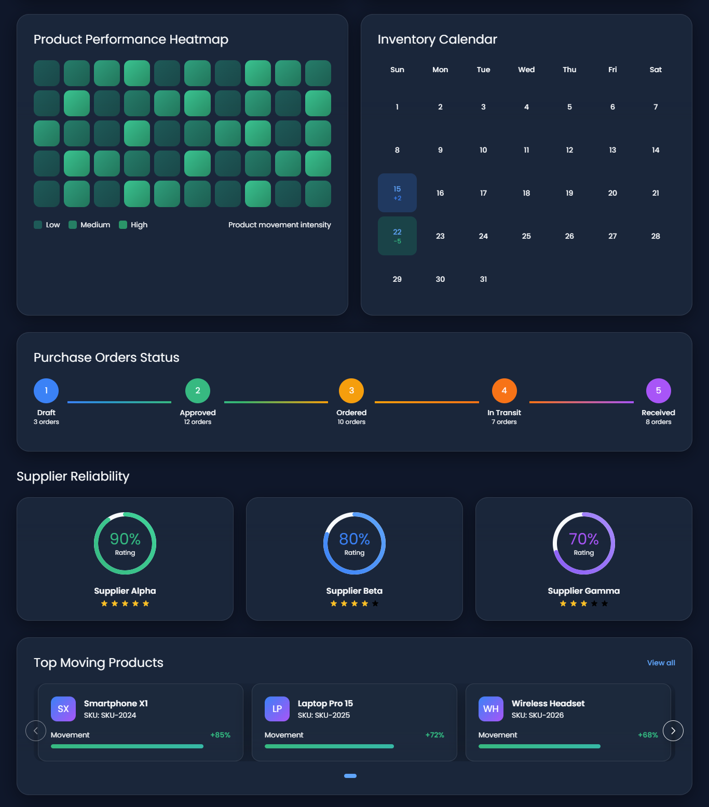
</p>

---

### 📦 Product & Inventory Management

<p align="center">
  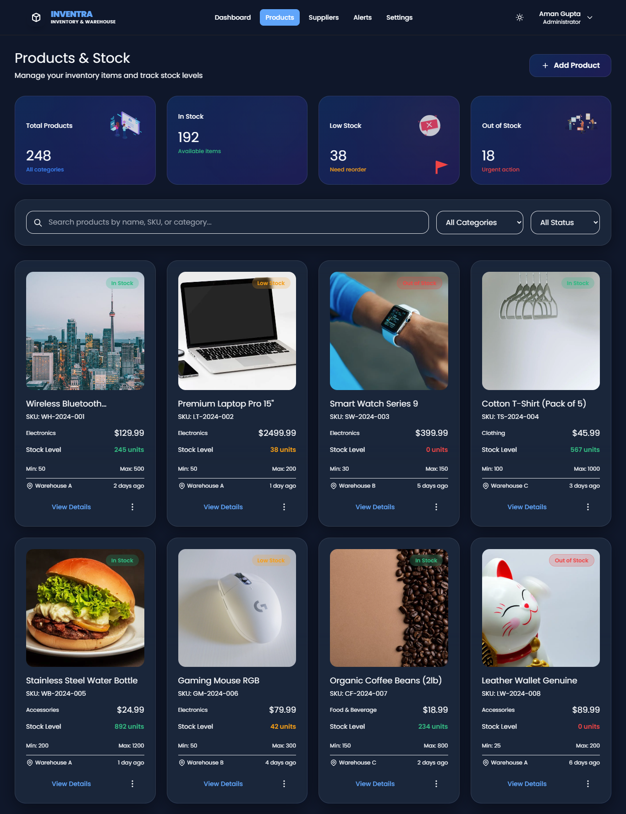
</p>

---

### 🤝 Supplier Intelligence Platform

<p align="center">
  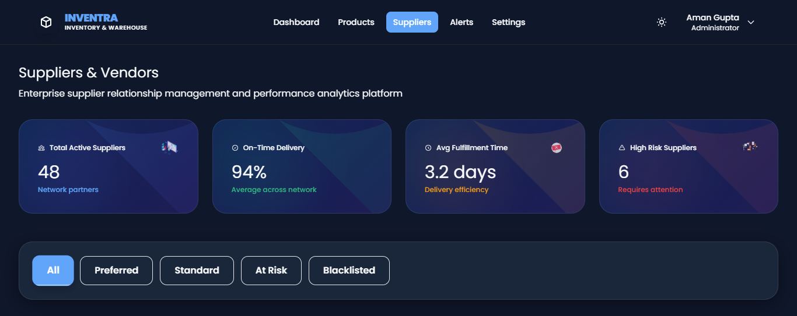
</p>

---

### 📊 Supplier Performance Analytics

<p align="center">
  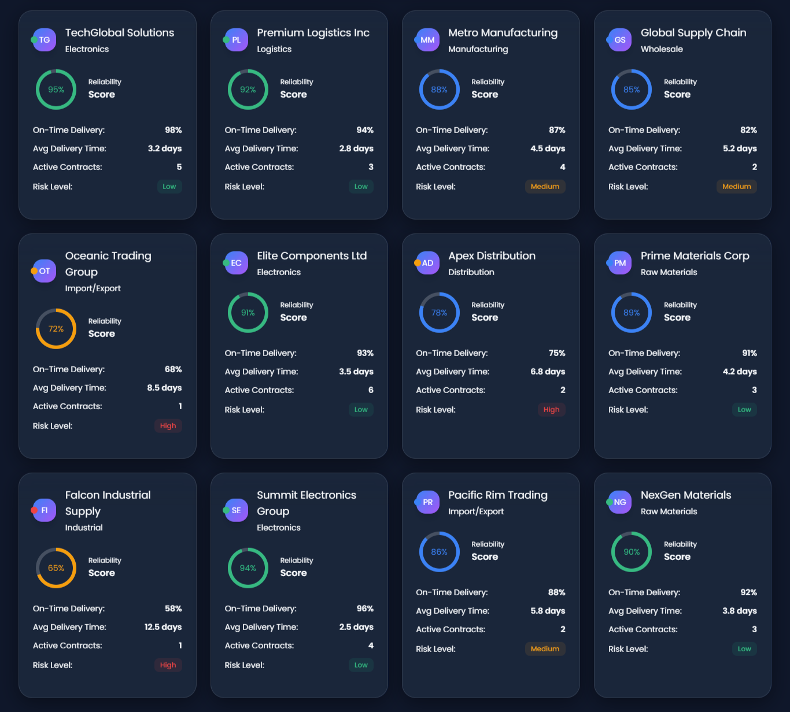
</p>

---

### 🏢 Supplier Risk & Compliance Monitoring

<p align="center">
  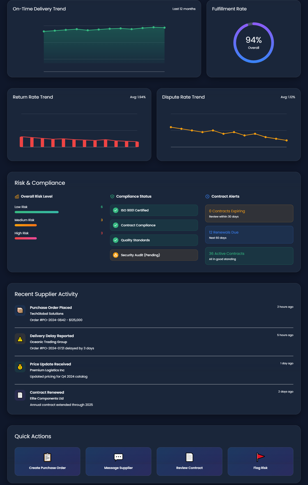
</p>

---

### 🚨 Operational Alerts & Reorder Management

<p align="center">
  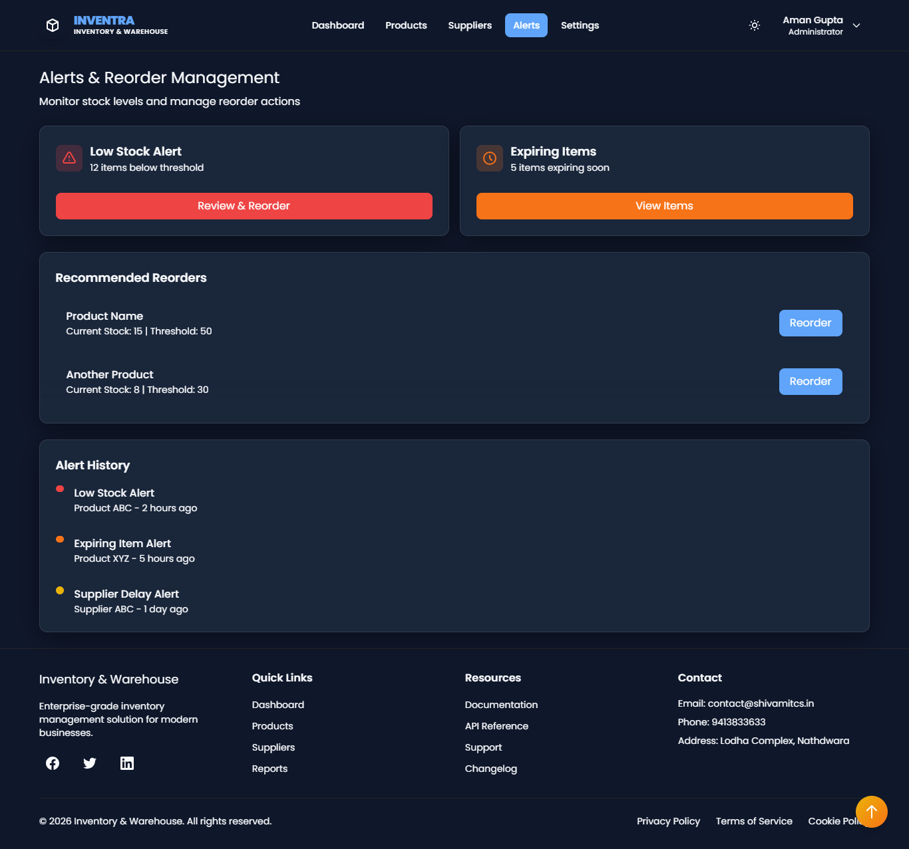
</p>

---

### ⚙️ Warehouse Configuration & Settings

<p align="center">
  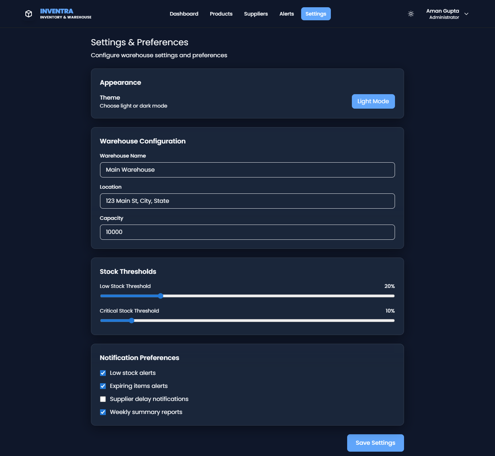
</p>

---

## 🔐 Security Architecture

The platform incorporates enterprise-grade operational security controls.

Security capabilities include:

* Role-Based Access Control (RBAC)
* Protected operational dashboards
* Secure workflow management
* Permission-based operations
* Operational data protection

---

## ⚡ Scalability Engineering

The platform is designed to support growing inventory and warehouse operations.

Scalability features include:

* Modular application architecture
* Multi-warehouse support
* Expandable operational workflows
* Performance-optimized dashboards
* Enterprise deployment readiness
* Future operational scalability

---

## 📈 Business Problem

Organizations often struggle with fragmented inventory systems, limited warehouse visibility, inefficient supplier coordination, and manual operational processes.

Common challenges include:

* Inventory inaccuracies
* Stock shortages
* Overstock situations
* Poor warehouse visibility
* Inefficient procurement processes
* Limited supplier performance insights
* Reactive inventory management

These challenges impact operational efficiency, inventory accuracy, customer fulfillment, and business growth.

---

## 💡 Solution

The Inventory Warehouse Intelligence Platform centralizes inventory operations, warehouse management, supplier intelligence, and operational analytics into one unified platform.

The solution enables organizations to:

* Improve inventory visibility
* Monitor warehouse performance
* Optimize inventory movement
* Strengthen supplier management
* Improve operational decision-making
* Increase inventory accuracy
* Enhance operational efficiency

---

## 🎯 Platform Focus Areas

- Inventory Management
- Warehouse Operations
- Supplier Intelligence
- Procurement Workflows
- Supply Chain Visibility
- Operational Analytics
- Inventory Optimization
- Enterprise Operations

---

## 🎯 Business Use Cases

* Inventory Management
* Warehouse Operations
* Distribution Centers
* Supply Chain Operations
* Retail Inventory Management
* Procurement Operations
* Logistics Management
* Enterprise Operations Monitoring

---

## 🛣️ Product Roadmap

### Phase 1 — Operational Foundation

* Inventory Management
* Warehouse Monitoring
* Supplier Management
* Alerts & Notifications
* Operational Dashboards

### Phase 2 — Intelligence Layer

* Advanced Analytics
* Inventory Optimization
* Supplier Intelligence
* Demand Forecasting
* Operational Reporting

### Phase 3 — Enterprise Scaling

* Multi-Warehouse Expansion
* Procurement Intelligence
* Advanced Reporting
* Enterprise Workflow Automation
* Operational Orchestration

### Phase 4 — Intelligent Operations

* Predictive Inventory Insights
* AI-Assisted Recommendations
* Advanced Operational Intelligence
* Intelligent Supply Chain Visibility
* Future-Ready Operations Infrastructure

---

## 🚀 Deployment Infrastructure

* Cloud Deployment Ready
* Static Hosting Support
* Containerization Ready
* Enterprise Infrastructure Support
* Production Deployment Workflows

---

## Repository Structure

```txt
assets/
├── architecture/
├── screenshots/
├── workflows/
└── branding/
```

---

## 🏗️ Engineering Vision

Inventory Warehouse Intelligence Platform represents a modern operational ecosystem designed to help organizations improve inventory visibility, warehouse efficiency, supplier collaboration, and operational intelligence.

The platform focuses on delivering scalable operational infrastructure, intelligent inventory management, and enterprise-ready business experiences.

---

## 🌍 Why This Platform Exists

Modern organizations require more than traditional inventory management tools.

This platform was created to provide a centralized operational ecosystem capable of managing inventory operations, warehouse performance, supplier intelligence, and operational visibility through a modern enterprise experience.

The goal is to help businesses make better operational decisions through visibility, analytics, intelligence, and scalable digital infrastructure.

---

## 📄 License

MIT License

Copyright © 2026 SHIVAM ITCS
